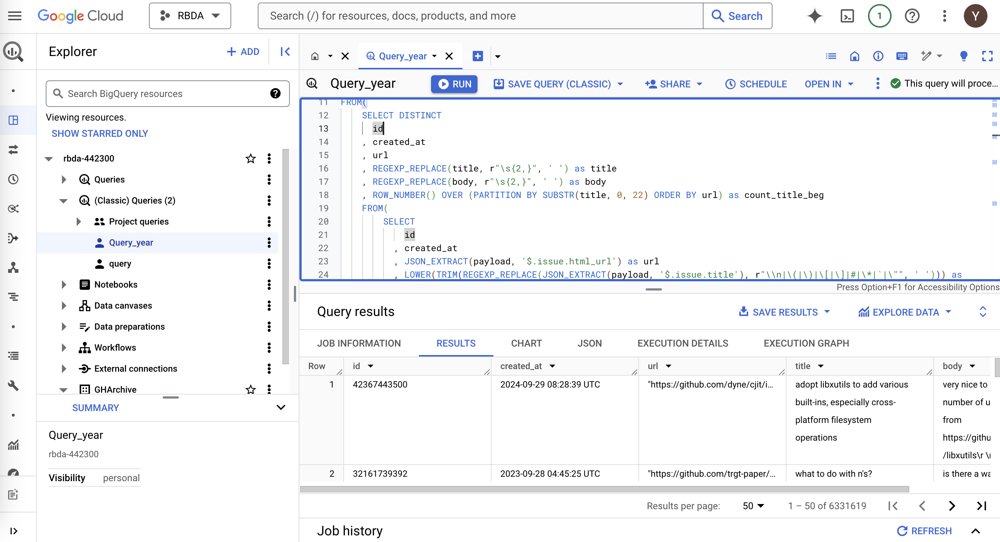
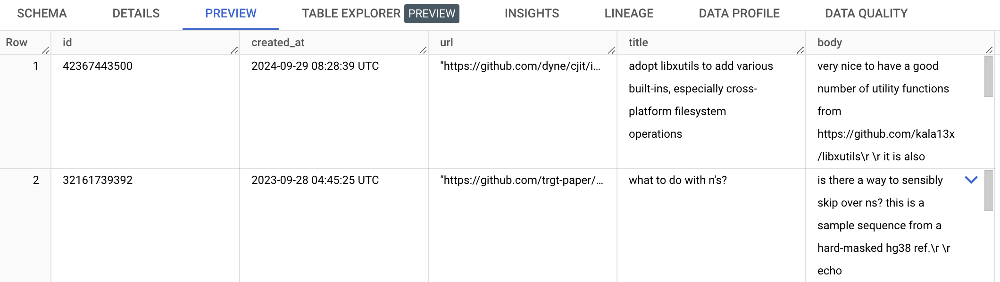
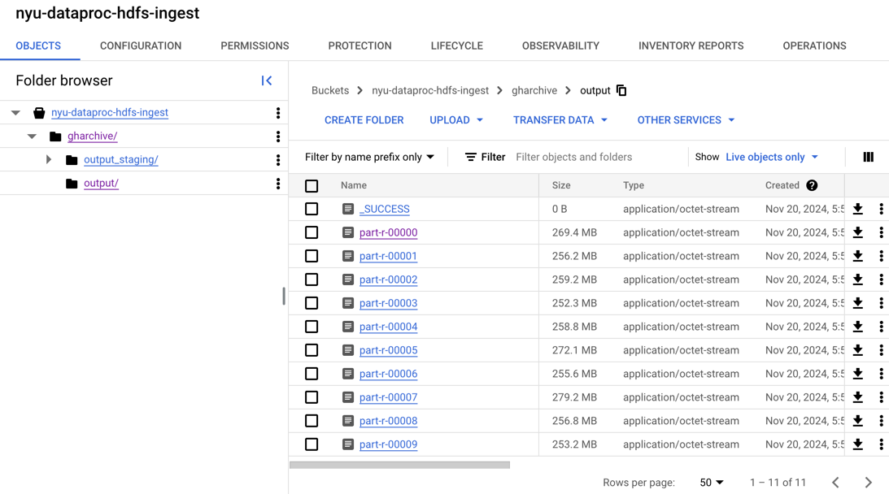

# Data perparation and ingestion

In our project, I selected [GH Archive](https://www.gharchive.org/) of 2023 and 2024 as one of data source. GH Archive dataset includes all records of the public GitHub timeline, such as all kinds of issues. Therefore, we will use content of issues in recent two years to analyze the trend of technology that has been used with time.

## Data Preparation

GH Archive dataset could be obtained from Google BigQuery with SQL query. The following picture shows the user interface of data fetching with BigQuery.


Parts of SQL query over CH Archive table of 2023 and 2024 is listed as below:
```SQL
SELECT
    id,
    created_at,
    JSON_EXTRACT(payload, '$.issue.html_url') as url,
    LOWER(TRIM(REGEXP_REPLACE(JSON_EXTRACT(payload, '$.issue.title'), r"\\n|\(|\)|\[|\]|#|\*|`|\"", ' '))) as title,
    LOWER(TRIM(REGEXP_REPLACE(JSON_EXTRACT(payload, '$.issue.body'), r"\\n|\(|\)|\[|\]|#|\*|`|\"", ' '))) as body
FROM `githubarchive.day.2024*`
WHERE  
    _TABLE_SUFFIX BETWEEN '0101' AND '1031'
    AND type="IssuesEvent" 
    AND JSON_EXTRACT(payload, '$.action') = "\"opened\"" 
```

Finally we can get our raw dataset with following schema:

| Field Name | Type | Description|
|-----------|-------|----|
|id|STRING| id of each issue|
|created_at|TIMESTAMP|create time of each issue|
|url|STRING|url for each issue|
|title|STRING|issue title|
|body| STRING| content of issue|

Here is a preview of raw dataset:


The raw dataset consists of 6,331,619 rows, and it is 4.13 GB in size. Then the dataset is exported to bucket `gs://nyu-dataproc-hdfs-ingest/gharchive` for further ingestion.

## Data ingestion

**Data ingestion consists of several steps**:
1. Total order sort for all data by `id`.
2. Normalize the `created_at` timestamp to a consistent format as `time` field.
3. Remove special characters or extra whitespaces from `title` and `body`, and combine them as `text` field.
4. Remove or replace non-printable characters, such as `\r`.
5. Add a `source` field with value `GH Archive`.

**Design of Mapper and Reducer**:
- Mapper: 
  - For sampling phase, mapper should yield `id` from each line in JSON input file.
  - For total order sorting phase, only identity mapper is required.
- Reducer:
  - For sampling phase, we don't need any reducer.
  - For total order sorting phase, reducer should do data cleaning as mentioned above and then output values.

**Execution**:

Upload all `DataIngest.java` file to DataProc, compile source code and generate `*.jar` file.

```shell
javac -classpath `hadoop classpath` *.java
jar cvf dataIngest.jar *.class
```
Usage: `DataIngest <input_path> <output_path>`

Then we can run `DataIngest` job using `jar` file.

```shell
hadoop jar dataIngest.jar DataIngest gs://nyu-dataproc-hdfs-ingest/gharchive gs://nyu-dataproc-hdfs-ingest/gharchive/output
```

**Result**:

After data ingestion with steps above, we can get the processed data, which is a snippet of the whole output data:
```json
{
  "id": "26163418660",
  "time": "2023-01-01 00:00:00 UTC",
  "text": "chart editor glitched out and overwrote a completed chart with a blank chart, describe your bug here.....",
  "source": "GH Archive"
}

{
  "id": "26163419820",
  "time": "2023-01-01 00:00:08 UTC",
  "text":"not a problem but a request, is there any way of creating a column for the numer of ratings......",
  "source": "GH Archive"
}

{
  "id": "26163424178",
  "time": "2023-01-01 00:00:51 UTC",
  "text": "play button doesn't work after processing all files or changing the playlist......",
  "source": "GH Archive"
}
```

There are 10 partitions of data file in total, each partition is about 260Mb in size. Data files are located at `gs://nyu-dataproc-hdfs-ingest/gharchive/output` directory.

